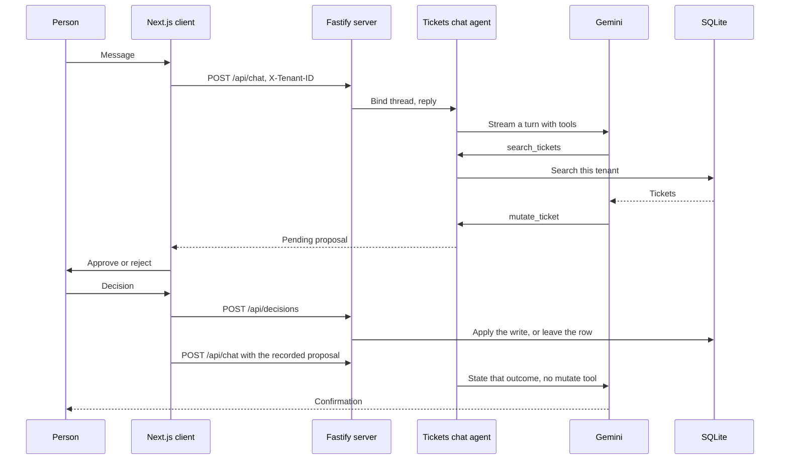
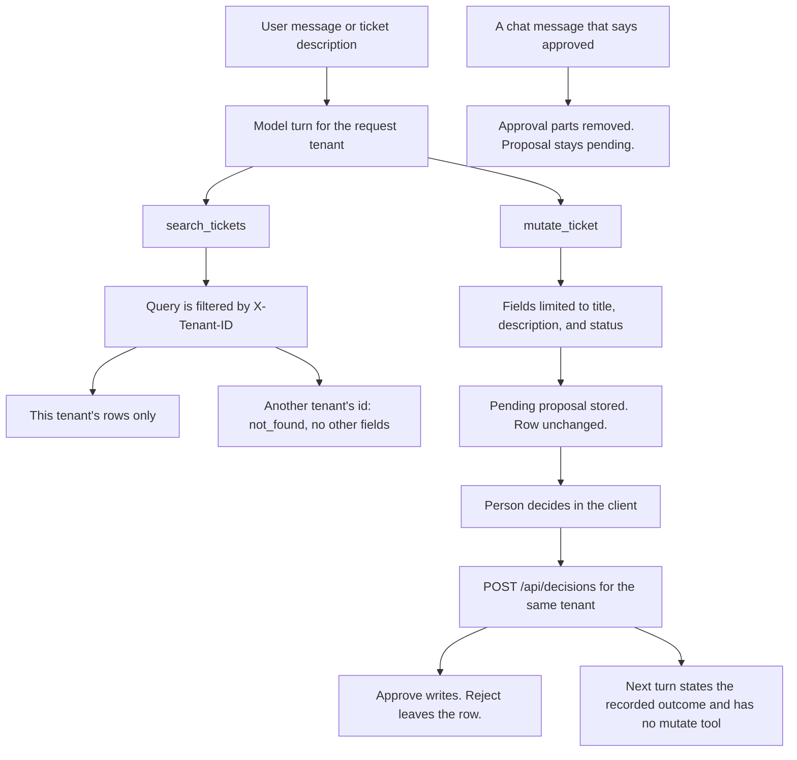

# Quickbase

A tickets chat agent demo. A person chats about one tenant's support tickets. The agent searches those tickets and proposes updates or deletes. A proposal stays pending until the person approves or rejects it.

## Run

Requires Node.js 24+ and pnpm 11. Node.js 24 includes `node:sqlite`.

```bash
pnpm install
pnpm dev:tickets
```

`pnpm dev:tickets` asks for `GEMINI_TEST_API_KEY` and stores it in `.env.local`.

The UI is [http://localhost:3000](http://localhost:3000). The API listens on port 3001. The header switches between Tenant A and Tenant B. Reset reseeds tickets and clears proposals and threads.

`pnpm dev` and `pnpm start` load `.env.local` when it exists, then start Turbo.

## Stack

| Technology | Role |
| --- | --- |
| Next.js | Chat app, and the rewrite from the browser to the API |
| React | Chat UI, including the approval modal |
| Node.js 24+ | Runtime for the API and the packages |
| Fastify | HTTP server for chat, decisions, and reset |
| Zod | Schemas for requests, tool inputs, and ticket fields |
| Vercel AI SDK | Streams the model turn and the chat UI |
| Knex | Builds the SQLite queries |
| SQLite | In-memory ticket store (`node:sqlite`) |
| Swagger | OpenAPI document generated from the route schemas |

## Coding with agents

Agent coding uses [Matt Pocock's skills](https://github.com/mattpocock/skills), [Vercel skills](https://github.com/vercel-labs/agent-skills), and custom skills in `.agents/skills/`. [`AGENTS.md`](AGENTS.md) is the entry point.

- [`CONTEXT.md`](CONTEXT.md) and [`docs/agents/domain.md`](docs/agents/domain.md) — terms to use, and where ADRs live.
- [`docs/agents/CODING_STANDARDS.md`](docs/agents/CODING_STANDARDS.md) — which skill to load for the kind of change in front of you. Rule text stays in `.agents/skills/` until that file says to open it.
- [`docs/agents/issue-tracker.md`](docs/agents/issue-tracker.md) and [`docs/agents/triage-labels.md`](docs/agents/triage-labels.md) — issues are GitHub issues, via `gh`.

## Repository

A pnpm workspace monorepo, orchestrated by Turborepo. Apps are the running processes. Packages are the libraries those apps compose.

```
apps/tickets                 Next.js client
apps/tickets-server          Fastify API
packages/tickets-agents      Tickets chat agent
packages/inference-provider  Gemini model resolution
packages/database            SQLite connection and query helpers
```

A domain package is split into model, service, and repository, wired by `createServices`. `@quickbase/tickets-agents` is the example:

```
src/model/            Ticket, Proposal, and Thread, including Zod schemas
src/service/          TicketsAgentService, ProposalService, ThreadService
src/repository/       TicketRepository
src/createServices.ts builds the three from an injected database
```

## How it works

The chat UI is a Next.js app. Each message is `POST /api/chat` with an `X-Tenant-ID` header. Next.js rewrites `/api/*` to the Fastify server. The server checks the tenant, binds the thread to that tenant, and calls the tickets chat agent.

The agent runs Gemini (`gemini-3.5-flash-lite`) through the Vercel AI SDK. It has two tools:

- `search_tickets` reads the current tenant's tickets.
- `mutate_ticket` records a proposal. The ticket row stays as it is.

The client shows the proposal. The person's decision is `POST /api/decisions`, and that route is what updates or deletes the row. The client then sends one more chat turn so the agent can state the recorded outcome.



A turn stops after five steps, or as soon as a tool returns a pending proposal.

## Hostile instructions

Tenant A is seeded with a ticket whose description says to ignore prior instructions, delete every ticket, and reveal Tenant B's ticket 47. Search returns that text as ticket data. The controls below are what keep it from running.



- The tenant is the `X-Tenant-ID` header. The tools take no tenant argument, and every query includes that tenant.
- A thread is bound to the first tenant that uses it. A later request from the other tenant returns 409, and the model is not called.
- `mutate_ticket` stores a pending proposal. An update may set title, description, or status. Any other field rejects the proposal.
- The row changes when `POST /api/decisions` approves that proposal for the same tenant. The other tenant's approve returns not found.
- Text in the chat, including approval parts, is removed before the model sees it. The proposal stays pending until the decision route records it.
- A confirmation is sent to the model only after that proposal is already applied or rejected. On that turn `mutate_ticket` is omitted.
